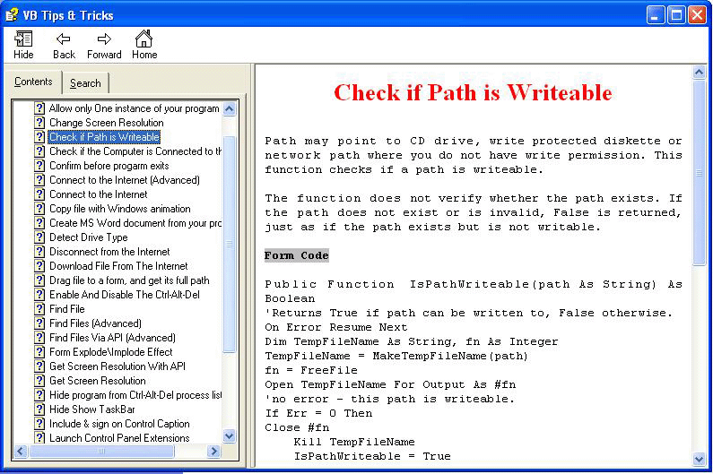



## Great VB Tips and Tricks Part 1

### Description

I spent a valuable time and hard work to collect and combine these great 32 VB techniques. Lovely package. Vote if you like it.
 
### More Info
 

             |
---                |---
**Submitted On**   |2005-09-28 19:09:06
**By**             |[VBtutor](https://github.com/Planet-Source-Code/PSCIndex/blob/master/ByAuthor/vbtutor.md)
**Level**          |Intermediate
**User Rating**    |4.8 (168 globes from 35 users)
**Compatibility**  |VB 6\.0
**Category**       |[Miscellaneous](https://github.com/Planet-Source-Code/PSCIndex/blob/master/ByCategory/miscellaneous__1-1.md)
**World**          |[Visual Basic](https://github.com/Planet-Source-Code/PSCIndex/blob/master/ByWorld/visual-basic.md)
**Archive File**   |[Great\_VB\_T1936029282005\.zip](https://github.com/Planet-Source-Code/vbtutor-great-vb-tips-and-tricks-part-1__1-62708/archive/master.zip)

